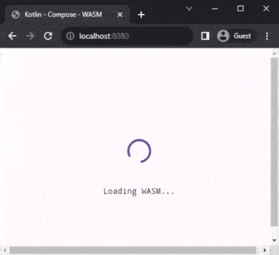
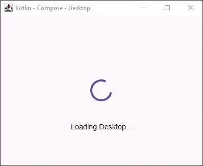
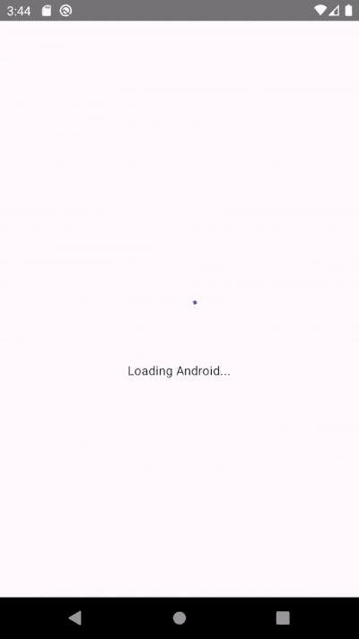

# Playground - Compose Multiplatform
Playing around with Compose Multiplatform `2023-09-11`.

Because I used the experimental WASM support for Compose, there's a few hacky bits copied from other examples to
make stuff work.

Platforms targeted:
* Android (Kotlin/Android) `./gradlew :android:installDebug`
* Desktop (Kotlin/JVM) `./gradlew :desktop:run`
* Website (Kotlin/WASM) `./gradlew :website:wasmRun`

Reading materials:
* https://www.jetbrains.com/lp/compose-multiplatform
* https://github.com/Kotlin/kotlin-wasm-examples/tree/main/compose-imageviewer#compose-multiplatform-for-web

## Screenshots
Website (WASM)  
  
Desktop  
  
Android  
  
